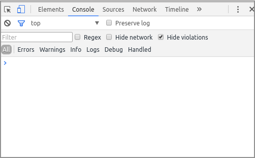
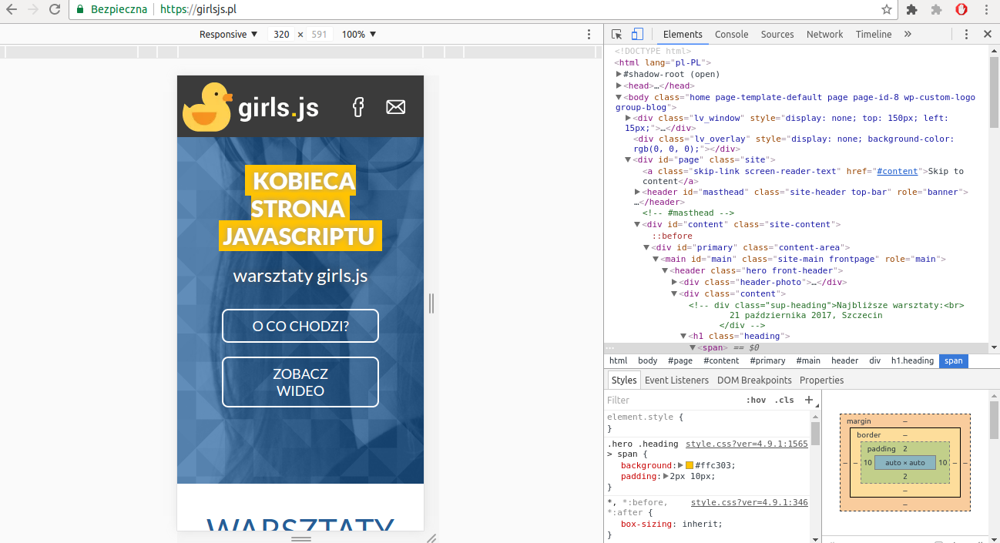
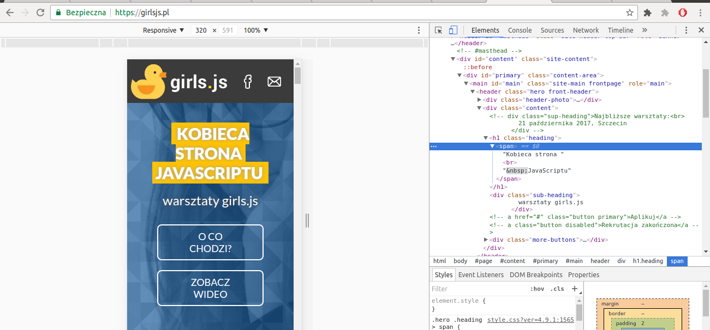
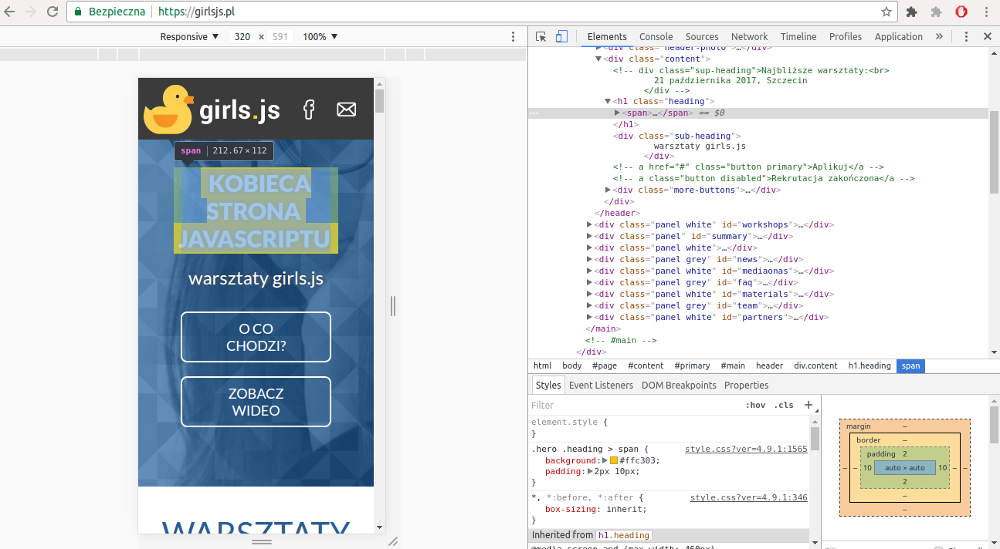
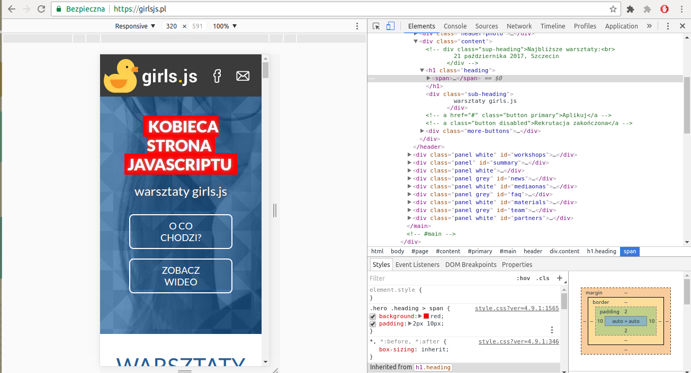

Na początku swojej przygody z językiem JavaScript warto zaprzyjaźnić się z konsolą przeglądarki. Jest to miejsce, gdzie jesteś w stanie szybko przetestować kod, ale też znaleźć informacje o błędach, które się pojawiły. W przeglądarce Chrome konsolę otwieramy za pomocą Ctrl+Shift+J, w Firefoxie Ctrl+Shift+K. W obu działa skrót F12 ;) Możesz też kliknąć prawym przyciskiem myszy w dowolnym miejscu otwartej strony, wybrać opcję "Zbadaj"/"Inspect", a potem przejść od zakładki "Console", gdy otworzą się narzędzia deweloperskie.  

Wpisz w konsoli `console.log('Hello World!');` i naciśnij klawisz Enter.
Twoja wiadomość powinna się wyświetlić pod spodem. Teraz wpisz `console.log(33+5);`

Właśnie wykonałaś swoje pierwsze operacje w JavaScript!

To, co wpisujesz bezpośrednio z konsoli \(z poziomu przeglądarki\), nie zostanie zapisane. Jednak jest to bardzo przydatne, gdy chcemy sprawdzić jakieś wartości np. zmiennych. Kiedy chcemy, by coś cały czas było pokazywane w konsoli, będziemy musieli wprowadzić kod w naszym pliku JavaScript, a potem sprawdzić konsolę. Konsola jest bardzo ważnym narzędziem przy pracy z kodem. To w niej będziemy sprawdzać, czy dobrze przypisałyśmy wartości do zmiennych, czy nasze funkcje dobrze działają, itd. Ale najpierw - treść strony!

Przejdźmy teraz do zakładki "Elements". Możesz tu zobaczyć całą strukturę swojej strony, czyli jej cały kod HTML oraz CSS. HTML odpowiada na szkielet naszej strony, tzn. informuje przeglądarkę, jakie elementy mają znaleźć się na stronie \(np. nagłówki, obrazki, bloki tekstu\). Z kolei CSS odpowiada za wygląd elementów, to reguły CSS powiedzą przeglądarce, np. jaki kolor ma mieć nagłówek.

Kliknij prawym przyciskiem myszy w dowolny element strony i wybierz "Zbadaj". Możesz go teraz łatwo znaleźć w strukturze strony. Kiedy najedziesz kursorem na część kodu HTML, ten element, za który dany fragment kodu odpowiada, zostanie zaznaczony. Dzięki temu możesz łatwo sprawdzić, jaki kod odpowiada za wybrane elementy.

W tym miejscu powinnyście też znaleźć zakładkę "Styles" gdzie znajdziecie wszystkie style elementu który właśnie zaznaczyłyście. 

Przykładowo: zaznaczony przez nas tekst **KOBIECA STRONA JAVASCRIPTU** ma:  
`background: #ffc303;`  
`padding: 2px 10px;`

Zmieńmy wartość `background` na `red`;

Tło naszego tekstu zmieniło kolor! Warto dodać, że te zmiany nie zapisują się na stałe. Jeśli teraz odświeżymy przeglądarkę, nasza zmiana koloru zniknie. Takie modyfikacje bezpośrednio w przeglądarce służą do sprawdzenia, jak wyglądałaby nasza strona, gdyby miała dane style CSS. Aby nasz nagłówek miał cały czas czerwone tło, musiałybyśmy zrobić zmianę w pliku z kodem.

